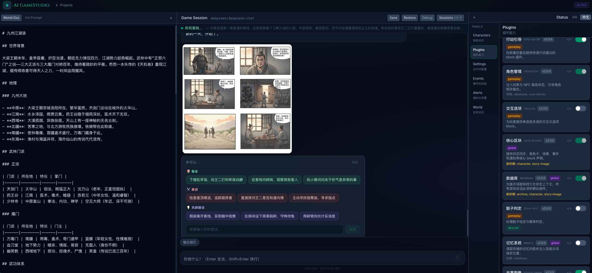

# AI GameStudio (English)

[中文](README.md) | [中文独立页](README.zh.md)

Write your world in Markdown, run the story as a chat session, and generate key scene images when needed.



## What the screenshot already tells you

- Left: `World Doc` holds your setting, factions, and rules in plain text.
- Center: `Game Session` is where each player message advances story and state.
- Lower center: the story image card renders `story_image` blocks and supports regeneration.
- Right: one side panel for characters, plugins, settings, and events.
- Top and bottom: practical controls (`Save / Restore / Debug / Sessions`) and turn input box.

## What changed in the latest updates

- Plugins now use clear `manifest.json` files, so dependencies, blocks, and settings are runtime-readable.
- The story-image pipeline is now end-to-end: generation, continuity references, UI rendering, and regenerate flow.
- Backend foundations were strengthened with capability execution, script execution, and audit logging.
- Plugin toggles and runtime settings sync with the UI more reliably for day-to-day debugging.

## Quick start

1. Install [mise](https://mise.jdx.dev/)
2. Initialize:

```bash
mise trust
mise install
cp .env.example .env
mise run setup
```

3. Configure model access in `.env`:

```env
LLM_MODEL=gpt-4o-mini
LLM_API_KEY=your-api-key-here
```

4. Start dev servers (two terminals):

```bash
mise run dev:backend
mise run dev:frontend
```

- Frontend: `http://localhost:5173`
- Backend: `http://localhost:8000`

## Common commands

```bash
mise run test
mise run lint
mise run plugin:validate
mise run plugin:list
```

## Deploy on Vercel

This repo now supports Vercel deployment, using HTTP chat transport by default for production.

1. Import this repository in Vercel and deploy directly (`vercel.json` + `app.py` entrypoint are included).
2. Configure at least these environment variables:

```env
# Frontend build-time
VITE_CHAT_TRANSPORT=http
VITE_API_BASE_URL=/api

# Backend runtime
LLM_MODEL=gpt-4o-mini
LLM_API_KEY=your-api-key
DATABASE_URL=postgresql+asyncpg://<user>:<pass>@<host>/<db>
# CORS_ORIGINS=https://your-domain.vercel.app
```

3. Redeploy and open the Vercel URL.

Notes:
- If `DATABASE_URL` is not set, the app falls back to SQLite under `/tmp` on Vercel, which is demo-only and not durable.
- If you use story image generation, also configure `IMAGE_GEN_API_KEY` (and optionally `IMAGE_GEN_MODEL` / `IMAGE_GEN_API_BASE`).

## Repo map

- `frontend/`: game UI and interactions
- `backend/`: orchestration, plugin runtime, API/WebSocket
- `plugins/`: built-in plugins (including `story-image`)
- `templates/worlds/`: world templates

## More docs

- Architecture: `docs/ARCHITECTURE.md`
- Plugin spec: `docs/PLUGIN-SPEC-v2.md`
- Product doc: `docs/PRD.md`
