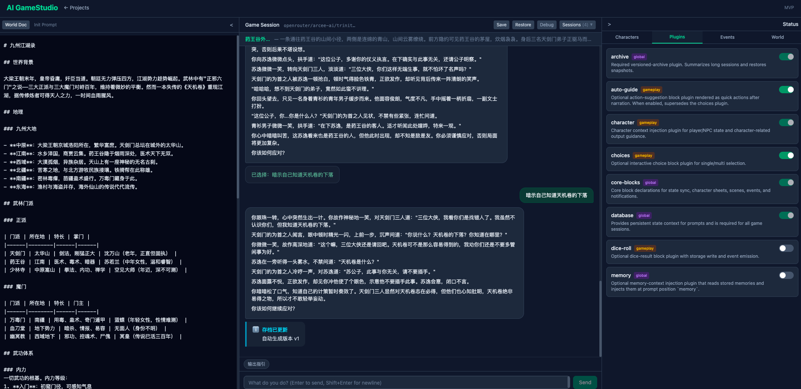

# AI GameStudio (English)

[中文](README.zh.md) | [Home](README.md)

LLM-native low-code RPG editor and runtime platform.

> **WIP (Work in Progress):** This project is in active development. APIs, plugin behaviors, and docs may change frequently.



## What Is AI GameStudio?

AI GameStudio is a web-based platform for building and playing RPG games with LLMs. Instead of hardcoding game logic, you write world rules in Markdown and extend gameplay with document-driven plugins (`PLUGIN.md`).

## Core Concepts

- **World Doc as Source Code**: game setting, rules, factions, lore, and tone are defined in Markdown.
- **Document-Driven Plugins**: plugins are declared in `plugins/*/PLUGIN.md`, with optional templates/schemas/scripts.
- **LLM-Native Runtime**: a DM-style orchestration model coordinates narration, state updates, and events.
- **Block Protocol (`json:<type>`)**: structured blocks are parsed by backend handlers and rendered by frontend components.

## Current Runtime (Implemented)

- **Frontend**: React + Zustand chat/game UI with block renderers and side panels.
- **Backend**: FastAPI + SQLModel + SQLite + WebSocket streaming.
- **Plugin Runtime**:
  - Implemented: plugin discovery, validation, dependency ordering, prompt injection, declarative block actions, request-scoped event bus.
  - Reserved (declared, not fully executed as framework): `hooks`, plugin-level `llm` task runtime, `exports.commands/queries` bus.
- **Archive System**: required archive plugin with periodic summary + snapshot restore.

Architecture baseline source: `docs/ARCHITECTURE.md` (updated: 2026-02-16).

## Built-in Plugin Set

- Required: `core-blocks`, `database`, `character`, `archive`
- Optional: `memory`, `choices`, `dice-roll`, `auto-guide`

## Tech Stack

- **Frontend**: Vite, React 19, TypeScript, Zustand, Tailwind CSS
- **Backend**: FastAPI, SQLModel, SQLite (`aiosqlite`), WebSocket
- **LLM Gateway**: LiteLLM
- **Tooling**: `mise` + `uv` + Node.js

See details in `docs/TECH-STACK.md`.

## Quick Start

### 1. Prerequisites

- Install [mise](https://mise.jdx.dev/)

### 2. Setup

```bash
mise trust
mise install
cp .env.example .env
mise run setup
```

Set your model key in `.env`:

```env
LLM_MODEL=gpt-4o-mini
LLM_API_KEY=your-api-key-here
# LLM_API_BASE=...  # optional (for custom gateway / local models)
```

### 3. Run in Development

Use two terminals:

```bash
mise run dev:backend
```

```bash
mise run dev:frontend
```

- Frontend: `http://localhost:5173`
- Backend API: `http://localhost:8000`
- Health check: `http://localhost:8000/api/health`

### 4. Run in Production-like Local Mode

```bash
mise run start
```

Then open `http://localhost:8000`.

## Useful Commands

```bash
mise run lint
mise run format
mise run plugin:validate
mise run plugin:list
mise run db:init
mise run db:reset
```

## World Templates

Prebuilt world settings are available under `templates/worlds/`:

- `wuxia.md`
- `cyberpunk.md`
- `dark-fantasy.md`
- `epoch.md`

## Documentation

- Product requirements: `docs/PRD.md`
- Current architecture: `docs/ARCHITECTURE.md`
- Plugin specification: `docs/PLUGIN-SPEC.md`
- Tech stack and environment: `docs/TECH-STACK.md`
- Architecture review report: `docs/ARCHITECTURE-REVIEW-2026-02-17.md`
