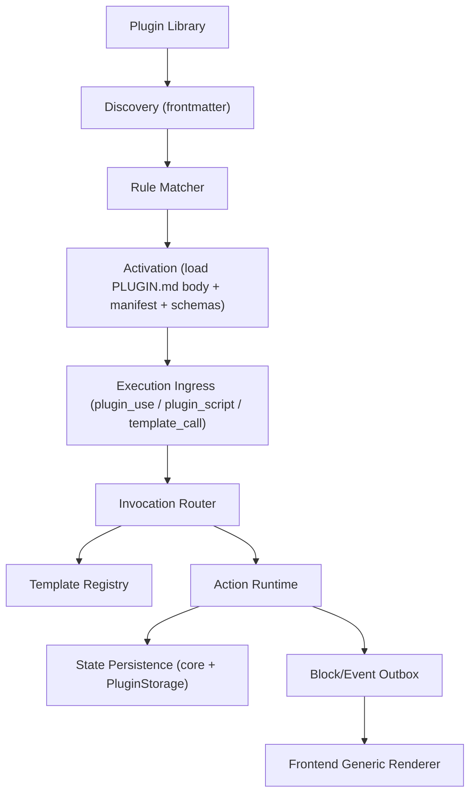

# AI GameStudio 插件生态架构 V2（Skill-First + Agent Skills 融合版）

> 本文是 V2 架构执行蓝图。目标是把插件系统从“配置 + 局部硬编码”升级为“运行手册 + 事实源 manifest + 强约束 schemas + 可扩展执行内核”。
>
> 设计参考：
>
> 1. [Agent Skills](https://agentskills.io/)
> 2. [Specification](https://agentskills.io/specification)
> 3. [Integrate skills](https://agentskills.io/integrate-skills)

---

## 1. 定位与冻结决策

本架构采用以下冻结决策，作为实现约束：

1. V2 在独立 worktree 开发，不在当前主线渐进掺入。
2. V2 单运行时，不保留 V1/V2 并行运行层。
3. 现有内置插件全部升级到 V2 后再切换默认运行时。
4. 包结构最小强制：`PLUGIN.md`、`README.md`、`manifest.json`、`schemas/`。
5. `PLUGIN.md` 是 LLM 运行手册；`manifest.json` 是唯一事实源。
6. `PLUGIN.md` frontmatter 的 `name/version` 必须与 `manifest.json` 一致。
7. `schemas/` 强制独立，支持 JSON/YAML，加载顺序为“索引优先、扫描回退”。
8. 协议新增 `json:plugin_use` 与 `json:plugin_script`，并保留既有 `json:*` block 体系。
9. 插件激活使用纯规则匹配，不使用 LLM 语义匹配。
10. 脚本执行首期仅 Python，本地直跑，默认不确认，后续可扩展语言。
11. 安全默认：`global` 插件默认可联网，`gameplay` 插件默认禁网；文件访问默认 `插件目录 + data 目录`。
12. API 不加 `/v2` 前缀，直接替换现有 `/api/plugins/*` 语义。
13. Phase 1 仅做导入，不做导出。
14. Phase 1 模板仅支持插件自带模板，不支持项目级覆盖模板。

---

## 2. 职责分离（必须遵守）

## 2.1 `PLUGIN.md`（运行手册）

`PLUGIN.md` 的职责是“指导 LLM 如何使用插件能力”，不是产品说明。

1. 提供触发与使用规则（什么时候用、什么时候不用）。
2. 提供执行步骤（如何调用能力/脚本/模板）。
3. 定义输出要求（必须输出哪些结构化 blocks）。
4. 定义失败降级策略（脚本失败、上下文不足时怎么退化）。

## 2.2 `README.md`（人类文档）

`README.md` 只服务开发者和维护者：

1. 插件功能介绍。
2. 安装、调试、测试说明。
3. 示例与注意事项。

## 2.3 `manifest.json`（事实源）

`manifest.json` 是唯一机器事实源：

1. 依赖、权限、能力、入口由 manifest 决定。
2. 运行时以 manifest 解析结果为准。
3. 与 `PLUGIN.md` 的一致性冲突时按“导入失败”处理，而不是运行时猜测。

## 2.4 `schemas/`（契约源）

`schemas/` 是强约束契约：

1. block/ui/command/template schema 必须可解析。
2. 运行时与 API 均以 `schemas/` 为主，不再以 `PLUGIN.md` 内嵌结构为主。

---

## 3. 运行时总览



运行时阶段定义：

1. Discovery：仅读取 frontmatter 级元信息（轻量）。
2. Matching：规则引擎选择激活插件。
3. Activation：加载 `PLUGIN.md` 正文、manifest、schemas。
4. Execution：执行 `plugin_use/plugin_script/template_call`。
5. Commit：Action Runtime 统一提交副作用并发出 blocks/events。

---

## 4. 核心扩展三件套

## 4.1 Invocation Router

职责：把调用请求路由到正确执行路径。

1. 输入：`plugin_use`、`plugin_script`、`template_call`。
2. 校验：插件启用状态、能力声明、权限、schema。
3. 路由：
   1. `plugin_use` -> capability/action。
   2. `plugin_script` -> script runner。
   3. `template_call` -> Template Registry。

## 4.2 Template Registry

职责：管理并执行插件自带模板（Phase 1）。

1. 模板来源：仅插件包内模板。
2. 模板入口：由 manifest 声明。
3. 模板输出：标准 `json:*` blocks 或 `plugin_use`。
4. 失败处理：按模板声明 fallback 或返回可解释错误 block。

## 4.3 Action Runtime

职责：统一副作用执行与提交边界。

1. 统一执行插件动作，不允许插件直接持有数据库会话。
2. 统一事务边界，保证调用过程可审计。
3. 统一产出 blocks/events/state updates，保持前端链路一致。

---

## 5. 结构化协议（最小对象）

## 5.1 `json:plugin_use`

```json
{
  "plugin": "quest-system",
  "capability": "quest.create",
  "args": {
    "title": "失落手稿",
    "issuer": "馆长"
  },
  "mode": "sync"
}
```

字段约束：

1. `plugin`: string，必须是已安装且已启用插件名。
2. `capability`: string，必须在 manifest 能力表中声明。
3. `args`: object，按能力输入 schema 校验。
4. `mode`: enum，可选，默认 `sync`。

## 5.2 `json:plugin_script`

```json
{
  "plugin": "dice-roll",
  "script": "scripts/roll.py",
  "input": {
    "expr": "2d6+3"
  },
  "timeout_ms": 5000
}
```

字段约束：

1. `plugin`: string。
2. `script`: string，相对插件目录路径。
3. `input`: object。
4. `timeout_ms`: integer，可选，默认由系统配置提供。

---

## 6. 目录与存储

## 6.1 插件目录优先级

加载优先级固定：

1. `project`：`/data/projects/<project_id>/plugins/<plugin-name>`
2. `user library`：`/data/plugin-library/<plugin-name>/<version>`
3. `builtin`：`/plugins/<plugin-name>`

同名插件按优先级覆盖；被覆盖插件不参与该项目运行时。

## 6.2 存储模型

坚持单主库策略：

1. 核心实体继续使用现有 core 表。
2. 插件状态继续使用 `PluginStorage`（命名空间隔离）。
3. 需要结构化插件实体时，可新增 `plugin_entities`，但不拆分为每插件独立主库。

---

## 7. 安全与执行边界

## 7.1 默认执行策略

1. 脚本执行默认无需确认。
2. 每次执行必须记录审计日志。
3. 脚本仅支持 Python（Phase 1）。

## 7.2 网络默认策略

按插件类型默认：

1. `global` 插件：默认允许联网。
2. `gameplay` 插件：默认禁网。

manifest 可显式声明覆盖默认值，但必须通过导入校验。

## 7.3 文件系统范围

脚本默认访问范围：

1. 当前插件目录。
2. `data/` 目录。

超出范围的读写请求必须拒绝并记录审计。

## 7.4 审计日志

每次脚本调用至少记录：

1. `invocation_id`
2. `plugin`
3. `script`
4. `args/input`
5. `exit_code`
6. `duration_ms`
7. `stdout`
8. `stderr`

---

## 8. API 变更（直接替换 `/api/plugins/*` 语义）

## 8.1 插件管理接口

1. `GET /api/plugins`
2. `POST /api/plugins/{plugin_name}/toggle`
3. `GET /api/plugins/enabled/{project_id}`
4. `GET /api/plugins/block-schemas?project_id=...`
5. `GET /api/plugins/block-conflicts?project_id=...`
6. `POST /api/plugins/import/validate`
7. `POST /api/plugins/import/install`

## 8.2 新增运行时接口

1. `POST /api/plugins/runtime/activate`
2. `POST /api/plugins/runtime/plugin-use`
3. `POST /api/plugins/runtime/plugin-script`
4. `GET /api/plugins/runtime/invocations/{invocation_id}`

运行时接口最小请求/响应契约：

1. `POST /api/plugins/runtime/plugin-use`
   1. Request:
      ```json
      {
        "project_id": "p_123",
        "session_id": "s_123",
        "payload": {
          "plugin": "quest-system",
          "capability": "quest.create",
          "args": {"title": "失落手稿"},
          "mode": "sync"
        }
      }
      ```
   2. Response:
      ```json
      {
        "ok": true,
        "invocation_id": "inv_001",
        "blocks": [{"type": "event", "data": {}}],
        "events": [{"name": "quest_created", "payload": {}}],
        "state_updates": []
      }
      ```
2. `POST /api/plugins/runtime/plugin-script`
   1. Request:
      ```json
      {
        "project_id": "p_123",
        "session_id": "s_123",
        "payload": {
          "plugin": "dice-roll",
          "script": "scripts/roll.py",
          "input": {"expr": "2d6+3"},
          "timeout_ms": 5000
        }
      }
      ```
   2. Response:
      ```json
      {
        "ok": true,
        "invocation_id": "inv_002",
        "result": {"total": 11, "detail": [4, 4], "mod": 3},
        "blocks": [{"type": "dice_result", "data": {}}],
        "audit_ref": "audit_002"
      }
      ```
3. `GET /api/plugins/runtime/invocations/{invocation_id}`
   1. Response:
      ```json
      {
        "invocation_id": "inv_002",
        "plugin": "dice-roll",
        "status": "success",
        "started_at": "2026-02-17T10:00:00Z",
        "ended_at": "2026-02-17T10:00:00Z",
        "duration_ms": 62,
        "audit": {
          "script": "scripts/roll.py",
          "exit_code": 0
        }
      }
      ```

## 8.3 关键响应字段变化

`GET /api/plugins` 必须新增字段：

1. `version`
2. `manifest_source`
3. `schema_status`
4. `script_mode`
5. `network_default`

`GET /api/plugins/block-schemas` 的 schema 来源改为 `schemas/`，不再以 `PLUGIN.md` 内嵌结构为主。

前端 `Plugin` 类型最小定义（必须同步更新）：

```ts
export interface Plugin {
  name: string
  description: string
  type: 'global' | 'gameplay'
  required: boolean
  enabled: boolean
  dependencies: string[]
  version: string
  manifest_source: 'project' | 'library' | 'builtin'
  schema_status: 'ok' | 'index_fallback' | 'missing' | 'invalid'
  script_mode: 'python-only'
  network_default: 'allow' | 'deny'
}
```

---

## 9. 落地映射（需要改动的代码路径）

## 9.1 后端

1. `/Users/wuyong/codes/game/ai-gamestudio/backend/app/core/plugin_engine.py`
2. `/Users/wuyong/codes/game/ai-gamestudio/backend/app/core/block_validation.py`
3. `/Users/wuyong/codes/game/ai-gamestudio/backend/app/core/block_parser.py`
4. `/Users/wuyong/codes/game/ai-gamestudio/backend/app/services/chat_service.py`
5. `/Users/wuyong/codes/game/ai-gamestudio/backend/app/api/plugins.py`

新增：

1. `/Users/wuyong/codes/game/ai-gamestudio/backend/app/core/invocation_router.py`
2. `/Users/wuyong/codes/game/ai-gamestudio/backend/app/core/template_registry.py`
3. `/Users/wuyong/codes/game/ai-gamestudio/backend/app/core/action_runtime.py`
4. `/Users/wuyong/codes/game/ai-gamestudio/backend/app/core/plugin_matcher.py`
5. `/Users/wuyong/codes/game/ai-gamestudio/backend/app/services/plugin_script_runner.py`
6. `/Users/wuyong/codes/game/ai-gamestudio/backend/app/services/plugin_import_service.py`

## 9.2 前端

1. `/Users/wuyong/codes/game/ai-gamestudio/frontend/src/types/index.ts`
2. `/Users/wuyong/codes/game/ai-gamestudio/frontend/src/services/api.ts`
3. `/Users/wuyong/codes/game/ai-gamestudio/frontend/src/stores/pluginStore.ts`
4. `/Users/wuyong/codes/game/ai-gamestudio/frontend/src/stores/blockSchemaStore.ts`
5. `/Users/wuyong/codes/game/ai-gamestudio/frontend/src/components/plugins/PluginPanel.tsx`

---

## 10. 分阶段实施

## Phase A：调用内核（plugin_use/plugin_script + invocation + action）

1. 实现 `plugin_use` 与 `plugin_script` 协议。
2. 实现 Invocation Router 与 Action Runtime 基础链路。
3. 实现脚本审计与执行边界。

## Phase B：模板注册中心

1. 实现插件自带模板注册与调用。
2. 接入 `template_call` 到统一执行链路。
3. 确保模板产物可回到现有 block 渲染路径。

## Phase C：导入完善与生态化

1. 完成导入校验与安装流程收敛。
2. 完善 schema 状态与冲突可视化。
3. 为后续导出、多语言脚本扩展留出接口。

---

## 11. 验收标准

1. 新插件接入能力时，不需要改核心后端业务分支。
2. 新插件新增交互时，不需要改前端业务组件，仅靠 schema 渲染。
3. 脚本执行具备可追踪、可限权、可回放能力。
4. `PLUGIN.md` 与 manifest 不一致会在导入阶段失败，而不是运行期容错。
5. 无索引 schema 可扫描回退；有索引 schema 必须优先使用。

---

## 12. 假设与默认值

1. 首期脚本语言仅支持 Python。
2. 首期不做插件导出。
3. 首期不做项目级模板覆盖。
4. API 路径不加 `/v2`，直接替换旧语义。
5. 规范中的“推荐”在首版实现中按“必须”执行，避免双轨语义。
